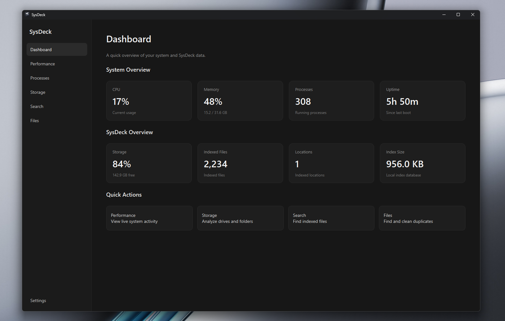
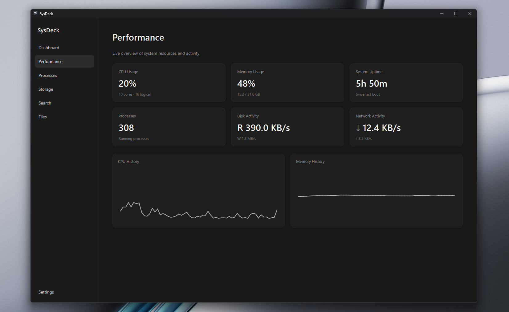
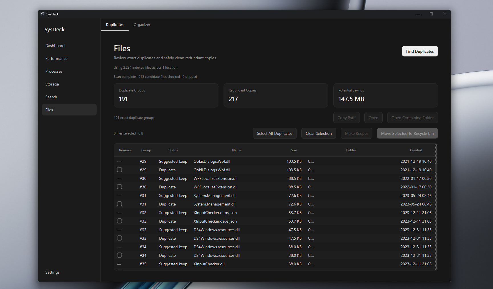
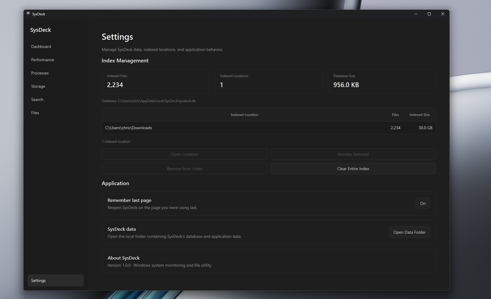

# SysDeck

SysDeck is a local-first Windows desktop utility built with Python and PySide6 for monitoring system activity, searching indexed files, analyzing storage, finding duplicate files, and organizing folders from one clean interface.

## Features

- **Dashboard** — Quick overview of CPU, memory, process count, uptime, storage, and SysDeck index statistics.
- **Performance** — Live CPU, memory, disk, network, uptime, and process activity with lightweight history graphs.
- **Processes** — Searchable and sortable view of running Windows processes with CPU and memory usage.
- **Storage** — Analyze drives and folders, inspect space usage, and surface large files.
- **Indexed Search** — Build a local metadata index and quickly search files by name or path using location, type, size, and modified-date filters.
- **Duplicate Finder** — Detect exact duplicate files using staged hashing and safely move selected copies to the Windows Recycle Bin.
- **Organizer** — Preview and organize loose files into categories without overwriting existing files.
- **Index Management** — Reindex, remove, or clear indexed locations from Settings.
- **Local App Settings** — Optional last-page restore and local application-data management.

## Screenshots

### Performance

### File Tools

### Settings

## Installation

SysDeck v1.0.0 is available as a Windows installer.

1. Open the repository's **Releases** page.
2. Download `SysDeck-Setup-1.0.0.exe`.
3. Run the installer.
4. Launch SysDeck from the Start Menu.

> **Note:** The current installer is not code-signed, so Windows SmartScreen may display an "Unknown publisher" warning.

### System Requirements

- Windows 10 or Windows 11
- 64-bit Windows

## Tech Stack

- Python
- PySide6 / Qt
- psutil
- SQLite
- Send2Trash
- PyInstaller
- Inno Setup
- Git / GitHub
