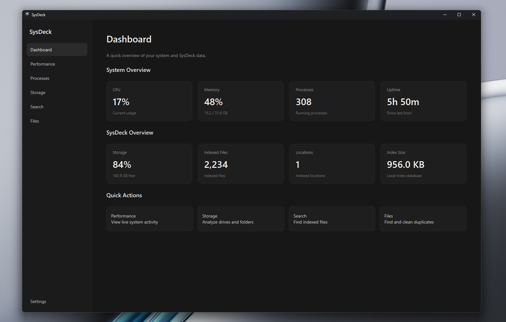
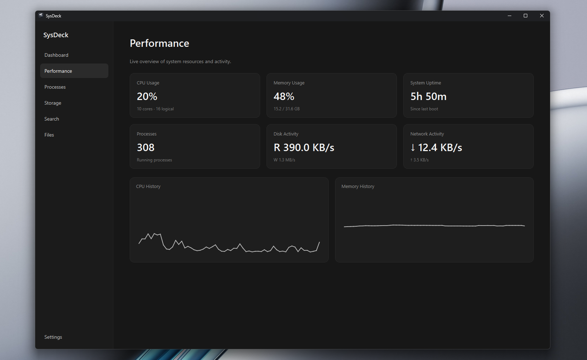
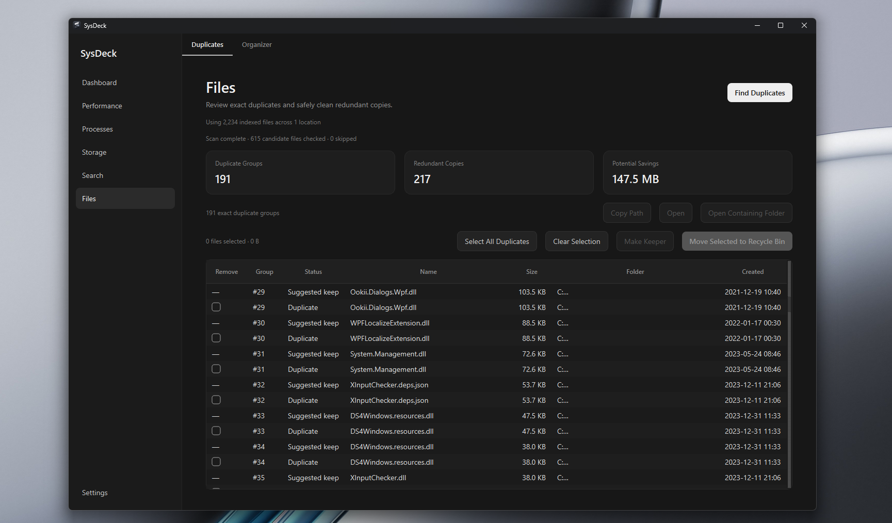
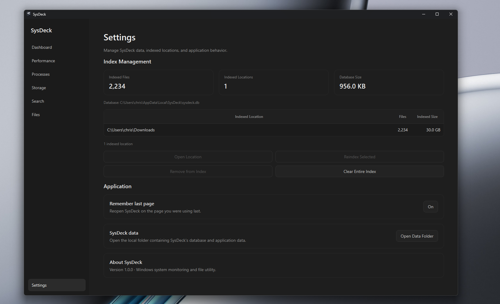

# SysDeck

SysDeck is a local-first Windows desktop utility built with Python and PySide6 for monitoring system activity, searching indexed files, analyzing storage, finding duplicate files, and organizing folders from one clean interface.



## Features

- **Dashboard** — Quick overview of CPU, memory, process count, uptime, storage, and SysDeck index statistics.
- **Performance** — Live CPU, memory, disk, network, uptime, and process activity with lightweight history graphs.
- **Processes** — Searchable and sortable view of running Windows processes with CPU and memory usage.
- **Storage** — Analyze drives and folders, inspect space usage, and surface large files.
- **Indexed Search** — Build a local metadata index and quickly search files by name or path using location, type, size, and modified-date filters.
- **Duplicate Finder** — Detect exact duplicate files using staged hashing and safely move selected copies to the Windows Recycle Bin.
- **Organizer** — Preview and organize loose files into categories without overwriting existing files.
- **Index Management** — Reindex, remove, or clear indexed locations from Settings.
- **Local App Settings** — Optional last-page restore and local application-data management.

## Screenshots

### Performance



### File Tools



### Settings



## Installation

SysDeck v1.0.0 is available as a Windows installer.

1. Open the repository's **Releases** page.
2. Download `SysDeck-Setup-1.0.0.exe`.
3. Run the installer.
4. Launch SysDeck from the Start Menu.

> **Note:** The current installer is not code-signed, so Windows SmartScreen may display an "Unknown publisher" warning.

### System Requirements

- Windows 10 or Windows 11
- 64-bit Windows

## Tech Stack

- Python
- PySide6 / Qt
- psutil
- SQLite
- Send2Trash
- PyInstaller
- Inno Setup
- Git / GitHub

## Run from source

Use Python 3.12+ on Windows x64. From the repository root in PowerShell:

```powershell
py -3.12 -m venv .venv
.\.venv\Scripts\python.exe -m pip install -r requirements.txt
.\.venv\Scripts\python.exe run_sysdeck.py
```

The source entry point starts the same PySide6 app as the installer. Indexes and settings are generated in the local user profile; no existing index database is required in Git.

## Build and check

```powershell
.\.venv\Scripts\python.exe -m compileall -q src run_sysdeck.py
.\.venv\Scripts\python.exe -m pip install pyinstaller
.\.venv\Scripts\python.exe -m PyInstaller SysDeck.spec
```

The portable app directory is `dist/SysDeck/`. To create the installer, install Inno Setup 6 and run `ISCC.exe installer/SysDeck.iss` with its compiler on PATH; output goes to `installer-output/`. Packaging outputs are generated locally and are not source dependencies.

## Status and limitations

This is a Windows-only local utility. It can inspect only files and processes available to the current user. Duplicate detection identifies exact content matches; organizing and recycling files are user-triggered operations. The repository has no automated unit-test suite; the syntax check above does not replace interactive testing of file operations or clean-machine installer validation. The existing v1.0.0 installer is unsigned.
